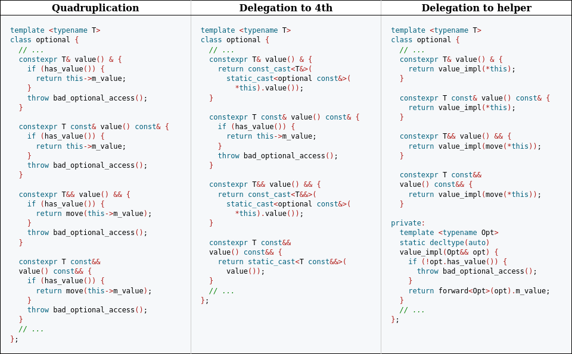
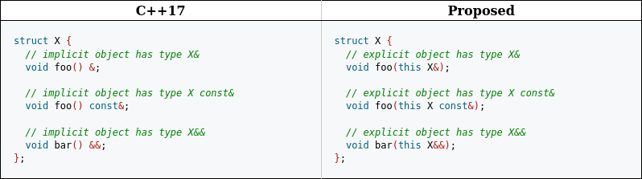
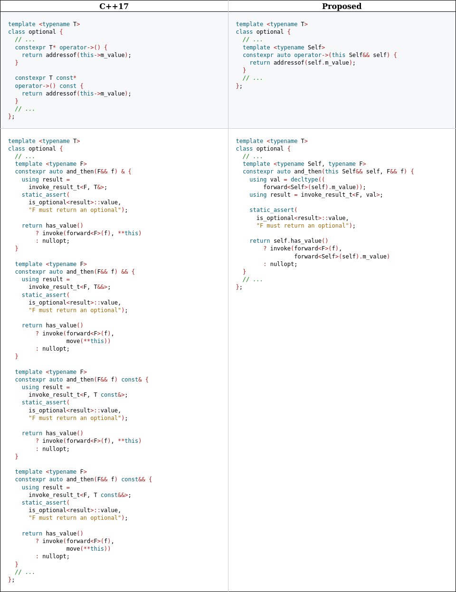
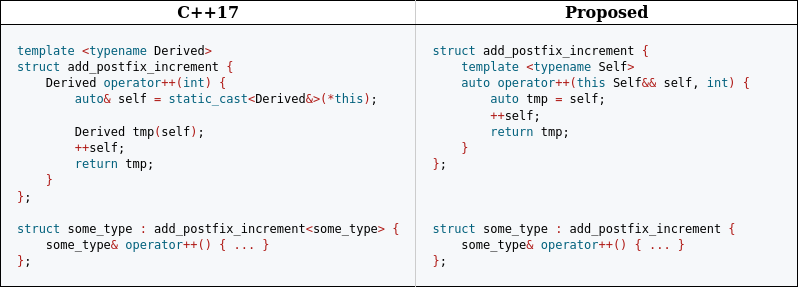

# Краткий обзор нововведений C++23: deducing this

Документ *«deducing this»*, принятый в последний стандарт C++, вводит новый, третий тип методов классов, сочетающий в себе свойства двух уже существующих: *нестатических* и *статических*, открывающий перед нами новые горизонты:

1. Дедупликация большого количества кода
2. Вытеснение CRTP (*Curiously Recuring Template Pattern*) на свалку истории, его замена более простой и очевидно понятной записью
3. Рекурсивные лямбды

И другое.

Но прежде чем рассмотреть само нововведение и его практические применения, углубимся немного в историю и попытаемся понять, почему в нем собственно возникла необходимость.

## Мотивация

Начиная с C++03, методы могут иметь [***cv-квалификаторы***](https://en.cppreference.com/w/cpp/language/cv), так что стали возможны сценарии, когда есть необходимость как в `const`, так и не-`const` перегрузке определенного метода (для краткости воздержимся от рассмотрения `volatile` перегрузок).

Во многих случаях между их логикой нет никакой разницы — отличаются лишь *квалификаторы используемых типов*, так что приходится или копировать определение, подгоняя квалификаторы, или использовать такие механизмы как `const_cast`:

```c++
class TextBlock {
public:
  char const& operator[](size_t position) const {
    // ...
    return text[position];
  }

  char& operator[](size_t position) {
    return const_cast<char&>(
      static_cast<TextBlock const&>(*this)[position]
    );
  }
  // ...
};
```

Начиная с C++11, методы могут иметь также и [***ref-квалификаторы***](https://en.cppreference.com/w/cpp/language/member_functions#member_functions_with_ref-qualifier), так что теперь вместо двух перегрузок одного метода нам могут понадобиться четыре: `&`, `const&`, `&&`, `const&&`, и у нас есть три способа решить данную задачу ([ссылка на код, приведенный ниже](https://godbolt.org/z/Pqvn3rKvh)):

1. Писать реализацию одного метода четырежды
2. Делегировать три перегрузки четвертой, используя `static_cast` и `const_cast`
3. Использовать вспомогательную шаблонную функцию



Но ни один из этих способов не избавляет нас от необходимости четырежды определять практически один и тот же метод.

Если бы могли написать что-то вроде функции ниже, но ведущей себя как член класса, это решило бы все наши проблемы:

```c++
template <typename T>
class optional {
    // ...
    template <typename Opt>
    friend decltype(auto) value(Opt&& o) {
        if (o.has_value()) {
            return forward<Opt>(o).m_value;
        }
        throw bad_optional_access();
    }
    // ...
};
```

Но мы не можем. Точней, *не могли*. До C++23

## Мечты воплощаются в реальность

Теперь же мы можем определять методы, явно принимающие в качества аргумента объект, над которым они были вызваны:

```c++
struct X {
    template <typename Self>
    void foo(this Self&&) { }
};

void example(X& x) {
    x.foo();            // Self = X&
    move(x).foo();      // Self = X
    X{}.foo();          // Self = X
}

```

Таким образом, теперь мы можем переписать всю ту простыню кода, реализующую метод `value` у `optional`, гораздо более компактно, меньше чем в десяток строк:

```c++
template <typename T>
struct optional {
  template <typename Self>
  constexpr auto&& value(this Self&& self) {
    if (!self.has_value()) {
      throw bad_optional_access();
    }
    return forward<Self>(self).m_value;
}
```

Мы подчинили своим целям механизм вывода типов во всей своей мощи! И важно отметить, что это *все тот же механизм*, проявляющий себя в обычных шаблонных функциях и методах.

*Deducing this* не вносит никаких изменений в правила вывода типов, он лишь позволяет явное объявление *объектного параметра* (*explicit object parameter*) в списке аргументов методов. Параметра, который до этого в методах присутствовал лишь *неявно* (*implicit object parameter*), в виде указателя `this`.

Важно отметить, что вывод типов способен выводить производные типы:

```c++
struct X {
  template <typename Self>
  void foo(this Self&&, int);
};

struct D : X { };

void example(X& x, D& d) {
    x.foo(1);               // Self=X&
    move(x).foo(2);         // Self=X
    d.foo(3);               // Self=D&
}
```

На методы, объявленные с явным объектным параметром, также накладывается ряд ограничений:

1. **Они не могут быть объявлены статическими**

Причина этого заключается в том, что хоть и внешне эти функции выглядят и ведут себя как обычные нестатические методы, но внутренне они ведут себя в точности как статические: в них **недоступен указатель `this`**, и единственный способ взаимодействовать в них с объектом класса — через явный объектный параметр.

Кроме того, **указатель на такие методы — это указатель на функцию**, а не член класса.

2. **Они не могут быть объявлены виртуальными**

3. **Они не могут быть объявлены с использованием *ref или cv квалификаторов***

Так как объявление явного объектного параметра уже несет в себе всю необходимую информацию о его типе:



## Но есть нюансы

Однако с большой силой приходит и большая ответственность. Так, используя новый тип методов, мы должны постоянно помнить о том, насколько могуществен механизм вывода типов:

```c++
struct B {
    int i = 0;

    template <typename Self> auto&& f1(this Self&& self) { return forward<Self>(self).i; }
};

struct D: B {
    double i = 3.14;
};
```

Тогда как `B().f1()` в коде выше вернет ссылку на `B::i`, `D().f5()` вернет ссылку на `D::i`, так как `self` является ссылкой на `D`.

Если же мы хотим получать ссылку на `B::i` всегда, нам необходимо явно предусмотреть это в коде:

```c++
template <typename Self>
auto&& f1(this Self&& self) {
    return forward<Self>(self).B::i;
}
```

Другой опасностью на нашем пути может служить проблема приватного наследования. Рассмотрим следующий код:

```c++
class B {
    int i;
public:
    template <typename Self>
    auto&& get(this Self&& self) {
        return forward<Self>(self).B::i;
    }
};

class D: private B {
    double i;
public:
    using B::get;
};

D().get(); // error
```

Мы, казалось бы, предохранились как могли. Однако недостаточно. Мы не можем получить доступ к `B::i` из `D`, так как наследование является приватным.

Но и для этой проблемы существует решение:

```c++
class B {
    int i;
public:
    template <typename Self>
    auto&& get(this Self&& self) {
        // like_t — функция, применяющая ref и cv квалификаторы
        // первого переданного типа ко второму
        // Например, like_t<int& double> = double&
        return ((like_t<Self, B>&&)self).i;
    }
};

class D : private B {
    double i;
public:
    using B::get;
};

D().get(); // now ok, and returns B::i
```

Выполнив приведение в стиле си для избежания проверки доступа, мы реализовали желаемое поведение.

## Практическое применение

Итак, немножко поговорив о сущности нововведения и об опасностях, которые могут нас поджидать при его использовании, перейдем к рассмотрению некоторых из его практических приложений.

### Дедупликация кода

Это первое и самое очевидное. Помимо уже рассмотренных примеров, приведу еще несколько:



### Внедрение методов в классы-наследники

Да-да, вы подумали правильно. CRTP (*Curiously Recurring Template Pattern*) больше не нужен. И хоть код от использования *deducing this* в простейшем случае ниже не становится короче, но очевидно становится более простым и интуитивно понятным.



### Рекурсивные лямбды

О чем я ранее еще не упоминал — это то, что теперь мы можем определять лямбды с явным объектным параметром, благодаря чему становится возможным определение рекурсивных лямбд:

```c++
auto fib = [](this auto self, int n) {
    if (n < 2) return n;
    return self(n-1) + self(n-2);
};
```

```c++
struct Leaf { };
struct Node;
using Tree = variant<Leaf, Node*>;
struct Node {
    Tree left;
    Tree right;
};

int num_leaves(Tree const& tree) {
    return visit(overload(        // <-----------------------------------+
        [](Leaf const&) { return 1; },                           //      |
        [](this auto const& self, Node* n) -> int {              //      |
            return visit(self, n->left) + visit(self, n->right); // <----+
        }
    ), tree);
}
```

### Передача self по значению

Передача `self` по значению открывает для нас возможность более естественного выражения желаемой семантики:

```c++
struct my_vector : vector<int> {
  auto sorted(this my_vector self) -> my_vector {
    sort(self.begin(), self.end());
    return self;
  }
};
```

Но, что многие справедливо посчитают более важным применением, позволяет в некоторых случаях достичь лучшей производительности.

Например, все мы знаем, что маленькие типы во избежание порождения лишних уровней косвенности (*indirection*) лучше передавать по значению.

К одному из таких типов относится `std::string_view`. Который мы можем передавать по значению всюду: в наши функции, конструкторы, другие методы. Но только не в его собственные методы. До принятия *deducing this* у разработчиков стандартной библиотеки не было способов избежать разыменований указателя `this` в собственных методах `std::string_view`.

Теперь же мы можем переписать все его методы, не выполняющие модификаций, с передачей явного объектного параметра по значению, практически бесплатно этим получая улучшение производительности:

```c++
template <class charT, class traits = char_traits<charT>>
class basic_string_view {
private:
    const_pointer data_;
    size_type size_;
public:
    constexpr const_iterator begin(this basic_string_view self) {
        return self.data_;
    }

    constexpr const_iterator end(this basic_string_view self) {
        return self.data_ + self.size_;
    }

    constexpr size_t size(this basic_string_view self) {
        return self.size_;
    }

    constexpr const_reference operator[](this basic_string_view self, size_type pos) {
        return self.data_[pos];
    }
};
```

## Заключение

На самом деле, это далеко не все, что можно сказать про *deducing this*, но самое главное и основное. Целью данной статьи не являлось углубление в детали.

Если вы хотите постичь все нюансы — вы можете обратиться к [оригинальному документу](https://www.open-std.org/jtc1/sc22/wg21/docs/papers/2021/p0847r6.html).

Также довольно интересы и увлекательны статьи, написанные некоторыми из его авторов: [*«C++23’s Deducing this: what it is, why it is, how to use it»*](https://devblogs.microsoft.com/cppblog/cpp23-deducing-this/) (Sy Brand), [*«Copy-on-write with Deducing this»*](https://brevzin.github.io/about/) (Barry Revzin)