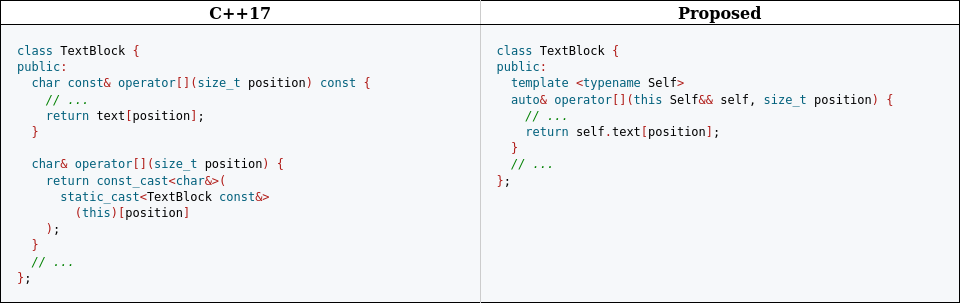
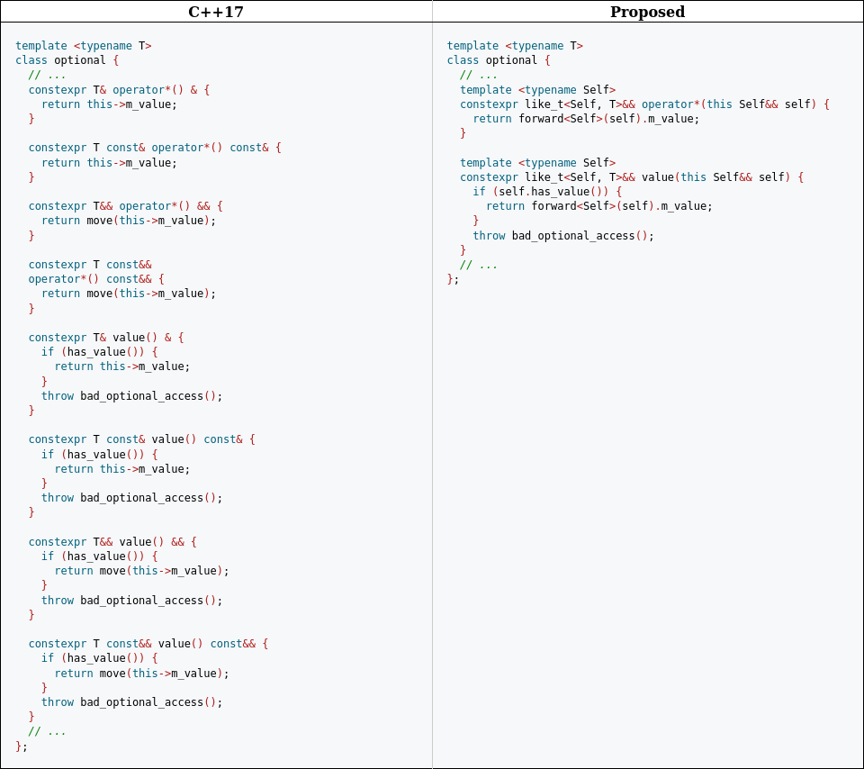

# Зачем мне эти ваши методы, или deducing this

## Преамбула (виртуальный заголовок)

## Основное содержание

### Аннотация

Данный документ вводит новый механизм явного указания и вывода категорий значений выражений, в контексте который вызван метод. 

### Мотивация

Начиная с C++03, методы могут иметь ***cv-квалификаторы***, так что стали возможны сценарии, когда есть необходимость как в `const`, так и не-`const` перегрузке определенного метода.

В большинстве случаев между их логикой нет никакой разницы — отличаются лишь типы, к которым обращаются и которые используют, так что приходится или копировать определение, подгоняя типы или квалификаторы, или использовать такие механизмы как `const_cast`:

```c++
class TextBlock {
public:
  char const& operator[](size_t position) const {
    // ...
    return text[position];
  }

  char& operator[](size_t position) {
    return const_cast<char&>(
      static_cast<TextBlock const&>(*this)[position]
    );
  }
  // ...
};
```

Начиная с C++11, методы могут иметь ***ref-квалификаторы***, так что теперь вместо двух перегрузок одного метода нам могут понадобиться четыре: `&`, `const&`, `&&` или `const&&`, и у нас есть три способа решить данную задачу:

1. Писать реализацию одного метода четырежды ([пример на godbolt](https://godbolt.org/z/Pqvn3rKvh))
2. Делегировать три перегрузки четвертой ([пример на godbolt](https://godbolt.org/z/Pqvn3rKvh))
3. Использовать вспомогательную шаблонную функцию ([пример на godbolt](https://godbolt.org/z/Pqvn3rKvh))


Мы просто вынуждены практически повторять один и тот же код четырежды.

Если бы могли написать что-то вроде функции ниже, но ведущей себя как метод, это решило бы все наши проблемы:

```c++
template <typename T>
class optional {
    // ...
    template <typename Opt>
    friend decltype(auto) value(Opt&& o) {
        if (o.has_value()) {
            return forward<Opt>(o).m_value;
        }
        throw bad_optional_access();
    }
    // ...
};
```

Но мы не можем. Точней, *не могли*. До C++23

### Мечты воплощаются в реальность

### Не все так радужно

### Практическое применение

#### Дедупликация кода





#### Внедрение методов в классы-наследники


#### Рекурсивные лямбды

```c++
auto fib = [](this auto self, int n) {
    if (n < 2) return n;
    return self(n-1) + self(n-2);
};
```

```c++
struct Leaf { };
struct Node;
using Tree = variant<Leaf, Node*>;
struct Node {
    Tree left;
    Tree right;
};

int num_leaves(Tree const& tree) {
    return visit(overload(        // <-----------------------------------+
        [](Leaf const&) { return 1; },                           //      |
        [](this auto const& self, Node* n) -> int {              //      |
            return visit(self, n->left) + visit(self, n->right); // <----+
        }
    ), tree);
}
```

#### Передача self по значению

```c++
struct my_vector : vector<int> {
  auto sorted(this my_vector self) -> my_vector {
    sort(self.begin(), self.end());
    return self;
  }
};
```

```c++
template <class charT, class traits = char_traits<charT>>
class basic_string_view {
private:
    const_pointer data_;
    size_type size_;
public:
    constexpr const_iterator begin(this basic_string_view self) {
        return self.data_;
    }

    constexpr const_iterator end(this basic_string_view self) {
        return self.data_ + self.size_;
    }

    constexpr size_t size(this basic_string_view self) {
        return self.size_;
    }

    constexpr const_reference operator[](this basic_string_view self, size_type pos) {
        return self.data_[pos];
    }
};
```